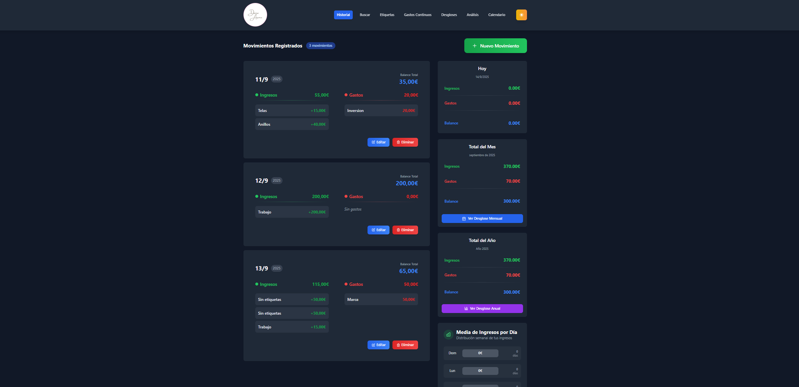
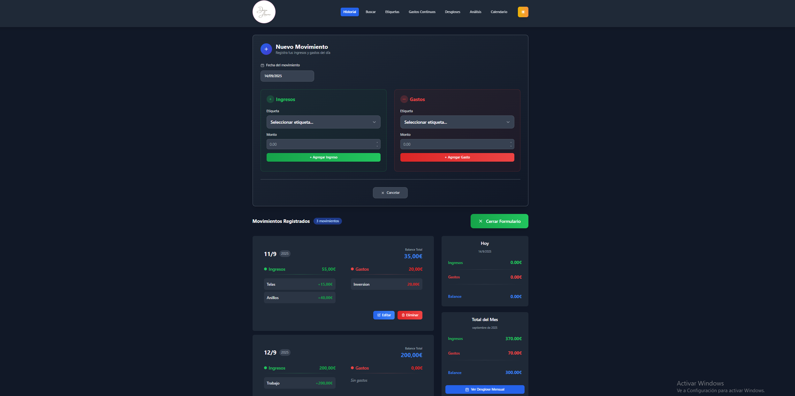
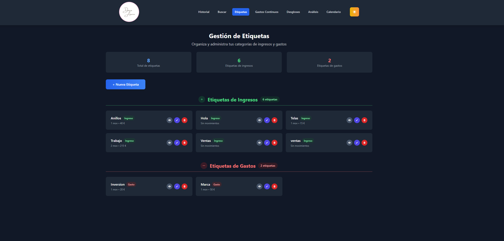
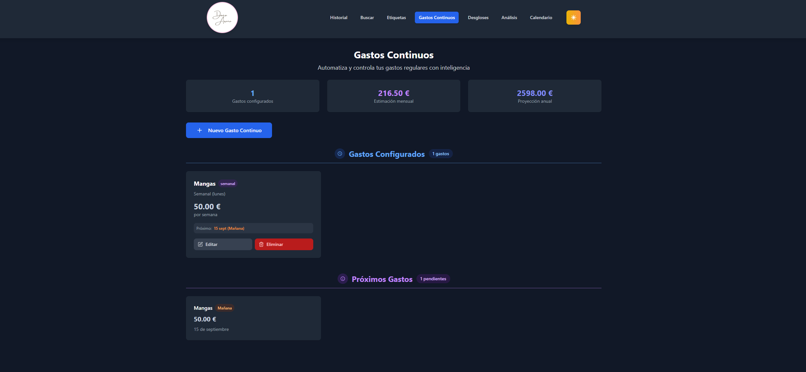
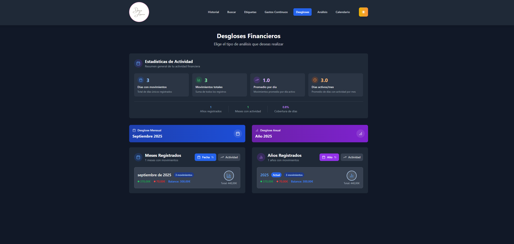
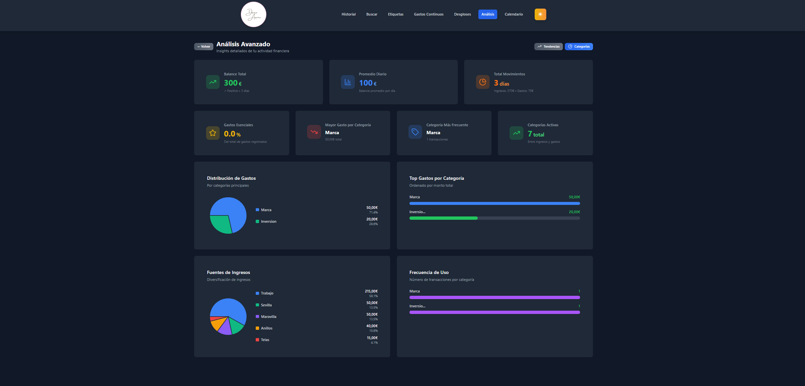
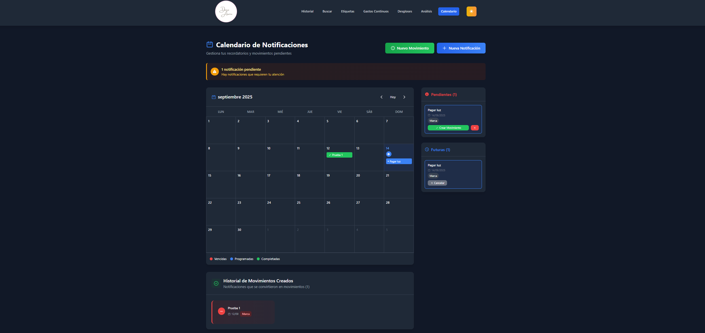

# 💝 Contabilidad App - Dedicado a Mi Heroína

> *"Para mi madre, que es madre soltera y dueña de un local - mi heroína y la que me enseñó todo. Este proyecto es mi manera de intentar devolverle un 0,00000001% de lo que ella me dio, para hacer su trabajo más fácil. A ella y a todas las dueñas de negocios locales a las que les daré este proyecto."*

---

## 🌟 Historia y Motivación

Este sistema de contabilidad nace del amor y admiración hacia mi madre, una mujer extraordinaria que siendo madre soltera ha sabido sacar adelante su negocio local con una dedicación y fortaleza que me inspira cada día. Ella me enseñó todo lo que sé sobre perseverancia, trabajo duro y nunca rendirse.

Viendo lo complejo que puede ser llevar la contabilidad de un negocio pequeño, especialmente cuando eres una mujer emprendedora que tiene que hacer malabares entre ser madre y empresaria, decidí crear esta herramienta. Mi objetivo es simplificar la gestión financiera para que pueda concentrarse en lo que mejor hace: hacer crecer su negocio y ser la madre increíble que siempre ha sido.

Este proyecto está destinado no solo a mi madre, sino a todas las valientes mujeres dueñas de negocios locales que luchan día a día por sus sueños y sus familias. Son las verdaderas heroínas de nuestras comunidades.

---

## 🖥️ Vista General del Sistema

### Pantalla Principal - Historial de Movimientos

*Vista principal donde se muestran todos los movimientos financieros organizados por día con balances automáticos.*

### Búsqueda Inteligente

*Sistema de búsqueda avanzado con filtros por fecha, tipo, etiqueta y monto para encontrar rápidamente cualquier transacción.*

### Gestión de Etiquetas

*Administración completa de categorías con diferenciación entre gastos esenciales y opcionales, colores personalizados y estadísticas.*

### Gastos Recurrentes

*Seguimiento de gastos que se repiten mensualmente para mejor planificación financiera.*

### Análisis de Desgloses

*Análisis detallado con gráficos interactivos para entender patrones de gasto e ingreso por categorías.*

### Vista de Análisis Avanzado

*Dashboard completo con métricas, tendencias y análisis predictivo para toma de decisiones informadas.*

### Calendario Financiero

*Vista calendario que muestra el flujo financiero día a día con indicadores visuales de ingresos y gastos.*

---

## 🚀 Tecnologías Utilizadas

### Backend - API Robusta
- **FastAPI**: Framework moderno de Python para APIs de alta performance
- **SQLAlchemy**: ORM avanzado para manejo de base de datos
- **SQLite**: Base de datos ligera pero potente
- **Uvicorn**: Servidor ASGI de alta velocidad
- **Documentación automática**: Swagger UI integrado

### Frontend - Interfaz Moderna
- **React 18**: Librería de interfaz de usuario con hooks modernos
- **TypeScript**: Tipado estático para mayor robustez del código
- **Vite**: Build tool ultra-rápido para desarrollo
- **Tailwind CSS**: Framework de CSS utilitario para diseño responsive
- **Lucide React**: Iconos modernos y consistentes
- **Axios**: Cliente HTTP para comunicación con la API

### Características Especiales
- **Responsive Design**: Optimizado para móviles y escritorio
- **Dark/Light Mode**: Tema claro y oscuro para comodidad visual
- **Real-time Updates**: Actualizaciones inmediatas sin recargar página
- **Validación Completa**: Validación tanto en frontend como backend
- **Análisis Visual**: Gráficos interactivos con múltiples tipos de visualización

---

## 📁 Estructura del Proyecto

```
contabilidad-web/
├── 📂 backend/                 # API Server (FastAPI)
│   ├── 📄 main.py             # Punto de entrada de la aplicación
│   ├── 📄 models.py           # Modelos de base de datos (SQLAlchemy)
│   ├── 📄 database.py         # Configuración de base de datos
│   ├── 📄 init_db.py          # Inicialización de base de datos
│   ├── 📄 run_dev.py          # Script de desarrollo
│   ├── 📄 requirements.txt    # Dependencias de Python
│   └── 📂 venv/               # Entorno virtual
│
├── 📂 frontend/               # Cliente React
│   ├── 📂 src/
│   │   ├── 📄 AppRefactored.tsx        # Componente principal
│   │   ├── 📂 components/
│   │   │   ├── 📂 dashboard/           # Componentes del dashboard
│   │   │   ├── 📂 forms/               # Formularios
│   │   │   ├── 📂 modals/              # Modales (crear/editar)
│   │   │   ├── 📂 views/               # Vistas principales
│   │   │   ├── 📂 charts/              # Componentes de gráficos
│   │   │   ├── 📂 ui/                  # Componentes UI reutilizables
│   │   │   ├── 📂 layout/              # Componentes de layout
│   │   │   ├── 📂 breakdown/           # Análisis y desgloses
│   │   │   └── 📂 analysis/            # Análisis avanzado
│   │   ├── 📂 utils/                   # Utilidades y helpers
│   │   └── 📂 types/                   # Definiciones de TypeScript
│   ├── 📂 public/             # Archivos estáticos del frontend
│   │   ├── 📄 Logo1.png      # Logo de la aplicación
│   │   └── 📄 c2.PNG - c8.PNG # Screenshots de la aplicación
│   ├── 📄 package.json        # Dependencias de Node.js
│   ├── 📄 tailwind.config.js  # Configuración de Tailwind
│   ├── 📄 tsconfig.json       # Configuración de TypeScript
│   └── 📄 vite.config.ts      # Configuración de Vite
│
├── 📄 docker-compose.yml     # Configuración de Docker (opcional)
├── 📄 install.sh            # Script de instalación automática
└── 📄 README.md             # Este archivo
```

---

## 🛠️ Instalación y Configuración

### Instalación Rápida (Recomendada)
```bash
# Clonar el repositorio
git clone <repository-url>
cd contabilidad-web

# Ejecutar script de instalación automática
chmod +x install.sh
./install.sh
```

### Instalación Manual

#### 1. Backend (API)
```bash
cd backend

# Crear entorno virtual
python3 -m venv venv
source venv/bin/activate  # Linux/Mac
# o en Windows: venv\Scripts\activate

# Instalar dependencias
pip install -r requirements.txt

# Inicializar base de datos
python init_db.py

# Ejecutar servidor de desarrollo
python run_dev.py
```

El backend estará disponible en `http://localhost:8000`
- API Docs: `http://localhost:8000/docs`
- ReDoc: `http://localhost:8000/redoc`

#### 2. Frontend (Cliente React)
```bash
cd frontend

# Instalar dependencias
npm install

# Ejecutar en modo desarrollo
npm run dev
```

El frontend estará disponible en `http://localhost:5173`

---

## 💡 Funcionalidades Principales

### 📊 Gestión Financiera Completa
- **Registro de Movimientos**: Añade ingresos y gastos de forma rápida e intuitiva
- **Categorización Inteligente**: Sistema de etiquetas con colores y tipos (esencial/opcional)
- **Balance Automático**: Cálculo automático de balances diarios y acumulados
- **Historial Detallado**: Visualización chronológica de todos los movimientos

### 🔍 Búsqueda y Filtrado Avanzado
- **Búsqueda por Texto**: Encuentra movimientos por descripción
- **Filtros por Fecha**: Rangos de fechas personalizables
- **Filtro por Tipo**: Ingresos, gastos o ambos
- **Filtro por Etiqueta**: Filtra por categorías específicas
- **Filtro por Monto**: Rangos de montos personalizables

### 📈 Análisis y Reportes
- **Gráficos Interactivos**: Múltiples tipos de visualización
- **Análisis por Categorías**: Distribución de gastos e ingresos
- **Tendencias Temporales**: Evolución de las finanzas en el tiempo
- **Gastos Esenciales vs Opcionales**: Análisis de prioridades
- **Vista Calendario**: Visualización mensual de flujo financiero

### 🏷️ Sistema de Etiquetas Avanzado
- **Creación Rápida**: Añade etiquetas sobre la marcha
- **Colores Personalizables**: Identifica visualmente las categorías
- **Tipos Diferenciados**: Distingue entre gastos e ingresos
- **Clasificación**: Marca gastos como esenciales u opcionales
- **Estadísticas**: Ve cuánto gastas en cada categoría

### 📱 Gastos Recurrentes
- **Seguimiento Mensual**: Identifica patrones de gasto
- **Planificación**: Anticipa gastos fijos
- **Análisis de Tendencias**: Ve cómo evolucionan tus gastos regulares

---

## 🎨 Características de Diseño

### Responsive Design
- **Mobile First**: Optimizado para dispositivos móviles
- **Tablet Friendly**: Experiencia perfecta en tablets
- **Desktop Enhanced**: Aprovecha pantallas grandes

### Temas Visuales
- **Modo Oscuro**: Reduce fatiga visual en ambientes con poca luz
- **Modo Claro**: Interfaz clara y limpia para uso diario
- **Transiciones Suaves**: Animaciones elegantes entre estados

### Experiencia de Usuario
- **Navegación Intuitiva**: Header responsive con menú hamburguesa
- **Feedback Visual**: Confirmaciones y estados de carga
- **Accesibilidad**: Contraste adecuado y navegación por teclado

---

## 🔧 Scripts Disponibles

### Backend
```bash
python run_dev.py          # Servidor de desarrollo
python init_db.py          # Inicializar base de datos
python -m pytest           # Ejecutar tests (si están configurados)
```

### Frontend
```bash
npm run dev                # Servidor de desarrollo
npm run build              # Build para producción
npm run preview            # Preview del build
npm run lint               # Linter
npm run typecheck          # Verificación de tipos TypeScript
```

---

## 🌐 API Endpoints

### Movimientos
- `GET /api/movimientos/` - Obtener todos los movimientos
- `POST /api/movimientos/` - Crear nuevo movimiento
- `GET /api/movimientos/{id}` - Obtener movimiento específico
- `PUT /api/movimientos/{id}` - Actualizar movimiento
- `DELETE /api/movimientos/{id}` - Eliminar movimiento

### Etiquetas
- `GET /api/etiquetas/` - Obtener todas las etiquetas
- `POST /api/etiquetas/` - Crear nueva etiqueta
- `PUT /api/etiquetas/{id}` - Actualizar etiqueta
- `DELETE /api/etiquetas/{id}` - Eliminar etiqueta

### Búsqueda y Análisis
- `GET /api/movimientos/buscar` - Búsqueda avanzada
- `GET /api/analisis/resumen` - Resumen financiero
- `GET /api/analisis/categorias` - Análisis por categorías

---

## 🤝 Contribuciones

Este proyecto está dedicado especialmente a mi madre y a todas las mujeres emprendedoras. Si tienes ideas para mejorarlo o quieres contribuir para ayudar a más pequeños empresarios, ¡todas las contribuciones son bienvenidas!

### Cómo Contribuir
1. Fork el proyecto
2. Crea una rama para tu feature (`git checkout -b feature/AmazingFeature`)
3. Commit tus cambios (`git commit -m 'Add some AmazingFeature'`)
4. Push a la rama (`git push origin feature/AmazingFeature`)
5. Abre un Pull Request

---

## 📄 Licencia

Este proyecto está bajo la Licencia MIT - ve el archivo `LICENSE` para más detalles.

---

## 💌 Mensaje Final

*Para mi madre: Gracias por ser mi inspiración constante. Por enseñarme que con trabajo duro y dedicación se puede lograr cualquier cosa. Por mostrarme lo que significa ser fuerte, independiente y nunca rendirse. Este pequeño proyecto es mi manera de decirte que admiro todo lo que has logrado y espero que esto pueda hacer tu día a día un poquito más fácil.*

*Para todas las mujeres emprendedoras: Ustedes son las verdaderas heroínas de nuestras comunidades. Siguen adelante, nunca se rindan, y sepan que hay quienes admiramos su fortaleza y dedicación.*

---

**Desarrollado con ❤️ por un hijo orgulloso para su heroína y todas las emprendedoras valientes.**

*Versión 1.0 - 2024*